## Экономим силы с помощью анализа мощности

- Статистические ошибки при проверке гипотез
- Мощность статистического теста
- *A priori* анализ мощности, оценка величины эффекта
- *Post hoc* анализ мощности
- Как влиять на мощность тестов

> - Вы сможете
    - дать определение ошибок I и II рода, и графически изобразить их отношение к мощности теста
    - оценивать величину эффекта и необходимый объем выборки по данным пилотного исследования
    - загружать данные из .xls в R
    - строить гистограммы и боксплоты с помощью `ggplot2`
    - сравнивать средние значения при помощи t-критерия, интерпретировать и описывать результаты
    - расчитывать фактическую мощность теста

--- .segue

# Статистические ошибки при проверке гипотез


---

## Типы ошибок при проверке гипотез


<table>
<col width = "16%">
</col>
<col width = "26%">
</col>
<col width = "26%">
</col>
<tbody>
<tr class = "odd">
<td class = "vheaver">
</td>
<td class = "vheaver">
H0 == TRUE
</td>
<td class = "vheaver">
H0 == FALSE
</td>
</tr>
<tr class = "even">
<td class = "hheader">
Отклонить<br />H0
</td>
<td>
Ошибка I рода<br />Ложно-положительный результат
</p>
</td>
<td>
Верно<br />Положительный результат
</td>
</tr>
<tr class = "odd">
<td class = "hheader">
Сохранить<br />H0
</td>
<td>
Верно<br />Отрицательный результат
</td>
<td>
Ошибка II рода<br />Ложно-отрицательный результат
</td>
</tr>
</tbody>
</table>


### Вероятности гипотез

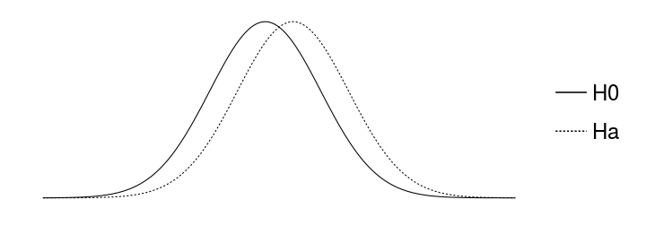

---

## Типы ошибок при проверке гипотез

<table>
<col width = "16%">
</col>
<col width = "26%">
</col>
<col width = "26%">
</col>
<tbody>
<tr class = "odd">
<td class = "vheaver">
</td>
<td class = "vheaver">
H0 == TRUE
</td>
<td class = "vheaver">
H0 == FALSE
</td>
</tr>
<tr class = "even">
<td class = "hheader">
Отклонить<br />H0
</td>
<td>
Ошибка I рода<br />Ложно-положительный результат
</p>
</td>
<td>
Верно<br />Положительный результат
</td>
</tr>
<tr class = "odd">
<td class = "hheader">
Сохранить<br />H0
</td>
<td>
Верно<br />Отрицательный результат
</td>
<td>
Ошибка II рода<br />Ложно-отрицательный результат
</td>
</tr>
</tbody>
</table>

### Ошибки I рода

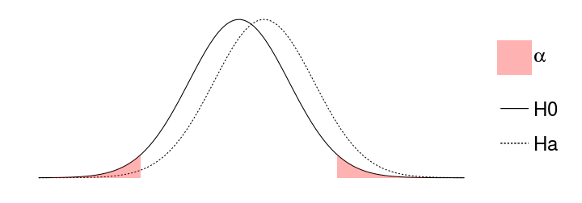

---


## Типы ошибок при проверке гипотез

<table>
<col width = "16%">
</col>
<col width = "26%">
</col>
<col width = "26%">
</col>
<tbody>
<tr class = "odd">
<td class = "vheaver">
</td>
<td class = "vheaver">
H0 == TRUE
</td>
<td class = "vheaver">
H0 == FALSE
</td>
</tr>
<tr class = "even">
<td class = "hheader">
Отклонить<br />H0
</td>
<td>
Ошибка I рода<br />Ложно-положительный результат
</p>
</td>
<td>
Верно<br />Положительный результат
</td>
</tr>
<tr class = "odd">
<td class = "hheader">
Сохранить<br />H0
</td>
<td>
Верно<br />Отрицательный результат
</td>
<td>
Ошибка II рода<br />Ложно-отрицательный результат
</td>
</tr>
</tbody>
</table>

### Ошибки II рода

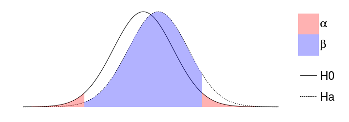

---


## Типы ошибок при проверке гипотез

<table>
<col width = "16%">
</col>
<col width = "26%">
</col>
<col width = "26%">
</col>
<tbody>
<tr class = "odd">
<td class = "vheaver">
</td>
<td class = "vheaver">
H0 == TRUE
</td>
<td class = "vheaver">
H0 == FALSE
</td>
</tr>
<tr class = "even">
<td class = "hheader">
Отклонить<br />H0
</td>
<td>
Ошибка I рода<br />Ложно-положительный результат
</p>
</td>
<td>
Верно<br />Положительный результат
</td>
</tr>
<tr class = "odd">
<td class = "hheader">
Сохранить<br />H0
</td>
<td>
Верно<br />Отрицательный результат
</td>
<td>
Ошибка II рода<br />Ложно-отрицательный результат
</td>
</tr>
</tbody>
</table>

### Мощность теста - способность выявлять различия $Power = 1 - \beta$

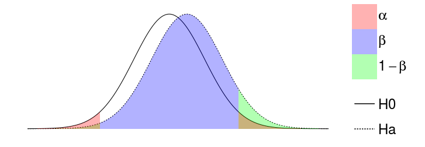


--- &twocol w1:40% w2:60%

## Анализ мощности


*** {name: left}

<center>*A priori*</center>

- какой нужен объем выборки, чтобы найти различия с разумной долей уверенности?
- различия какой величины мы можем найти, если известен объем выборки?

*** {name: right}

<center>*Post hoc*</center>

- смогли бы мы найти различия при помощи нашего эксперимента ($\alpha$, $n$), если бы величина эффекта была $X$?

--- .segue

# A priory анализ мощности 


--- .sub-section

## Пример: Заповедник спасает халиотисов *

Лов халиотисов (коммерческий и любительский) запретили, организовав заповедник.

Стало ли больше моллюсков через несколько лет? (Keough, King, 1991)

</br>

### Для a priori анализа нужно знать

- тест
- уровень значимости
- желаемая мощность теста—80%
- ожидаемая величина эффекта

<div class = "footnote">* - Данные из Quinn, Keough, 2002, Box 9-5, Fig 9-7</div>

---

## Что мы знаем для a priori анализа?

- тест — $t$-критерий
- уровень значимости — $alpha = 0.05$
- желаемая мощность теста — 80%

### Величина эффекта

$d$ Коэна (Cohen's d)

<br />
$$d = \frac{\bar \mu_1 - \bar \mu_2}{\sigma}$$

---
## Как оценить стандартное отклонение для расчета величины эффекта?

$$d = \frac{\bar \mu_1 - \bar \mu_2}{\sigma}$$

- как среднеквадратичное стандартное отклонение  
($d$ Коэна)

\[d = \frac{|\bar x_1 - \bar x_2|} {\sqrt{\frac {s_1^2 + s_2^2 } {2} }}\]

- как обобщенное стандартное отклонение  

($g$ Хеджа)

\[g = \frac{|\bar x _1 - \bar x _2|} {\sqrt{\frac {(n _1 - 1)s_1^2 + (n _2 - 1)s_2^2 }  {n _1 + n _2 - 2} } }\]

---

## Как оценить ожидаемую величину эффекта?

$$d = \frac{\bar \mu_1 - \bar \mu_2}{\sigma}$$

---

## Как оценить ожидаемую величину эффекта?

$$d = \frac{\bar \mu_1 - \bar \mu_2}{\sigma}$$

- Пилотные исследования
- Литература
- Общебиологические знания
- Технические требования

---

## Величина эффекта из общих соображений

Яков Коэн (1982)

сильные, умеренные и слабые эффекты

```r
library(pwr)
cohen.ES(test = "t", size = "large")
```

```
## 
##      Conventional effect size from Cohen (1982) 
## 
##            test = t
##            size = large
##     effect.size = 0.8
```

--- .prompt

## Рассчитайте 


величину умеренных и слабых эффектов для t-критерия


```r
    library()
    cohen.ES()
```

<small>Подсказка: обозначения можно посмотреть в файлах справки</small>


```r
    help(cohen.ES)
    ?cohen.ES
    cohen.ES # курсор на слове, нажать F1
```

---

## Величина эффекта из пилотных данных

$$d = \frac{\bar \mu_1 - \bar \mu_2}{\sigma}$$

### ${\sigma}$ - cтандартное отклонение плотности халиотисов:

> - Плотность крупных халиотисов на $50 м^2$ была $\bar x = 47.5$, $SD = 27.7$


### ${\bar \mu_1 - \bar \mu_2}$ - cредний вылов халиотисов в год:

> - Масса выловленных коммерческим способом + данные о размерах -> численность -> плотность
    - Предположили, что коммерческий лов и любительский лов равны
    - Коммерческий лов  = 11.6 экз. $м^{-2}$
    - Коммерческий + любительский лов = 23.2 экз. $м^{-2}$

---

## Данные для анализа мощности собраны


```r
alpha <- 0.05
power <- 0.80
sigma <- 27.7 # варьирование плотности халиотисов
diff <- 23.2 # ожидаемые различия плотности халиотисов
effect <- diff/sigma # величина эффекта
effect
```

```
## [1] 0.838
```


### Функции для анализа мощности t-критерия

- при одинаковых объемах групп `pwr.t.test()`
- при разных объемах групп `pwr.t2n.test()`

---

## Считаем объем выборки


```r
pwr.t.test(n = NULL, d = effect, power = power, sig.level = alpha, 
           type = "two.sample", alternative = "two.sided")
```

```
## 
##      Two-sample t test power calculation 
## 
##               n = 23.4
##               d = 0.838
##       sig.level = 0.05
##           power = 0.8
##     alternative = two.sided
## 
## NOTE: n is number in *each* group
```

>- Чтобы с вероятностью 0.8 выявить различия плотности халиотисов в местах, где лов разрешен и запрещен, нужно обследовать __по 24 места каждого типа__, если мы верно оценили величину эффекта.

--- .prompt

## Рассчитайте


сколько нужно обследовать мест, чтобы обнаружить слабый эффект  
с вероятностью 0.8, при уровне значимости 0.01


```r
    cohen.ES()
    pwr.t.test()
```

---

## Решение


```r
cohen.ES(test = "t", size = "small")
```

```
## 
##      Conventional effect size from Cohen (1982) 
## 
##            test = t
##            size = small
##     effect.size = 0.2
```

```r
pwr.t.test(n = NULL, d = 0.2, power = 0.8, sig.level = 0.01, 
           type = "two.sample", alternative = "two.sided")
```

```
## 
##      Two-sample t test power calculation 
## 
##               n = 586
##               d = 0.2
##       sig.level = 0.01
##           power = 0.8
##     alternative = two.sided
## 
## NOTE: n is number in *each* group
```

--- .sub-section

## Пример: Улитки на устрицах в мангровых зарослях *


В каких зонах мангровых зарослей на устрицах предпочитают обитать улитки?

Minchinton, Ross, 1999

> - Факторы:
  - Зона зарослей - 4 (по 5 проб - число улиток на раковинах устриц)
    - LZ - ближе к земле,
    - MZ - средняя часть, с деревьями,
    - SZ(-TR) - ближе к морю, с деревьями
- SZ(+TR) - ближе к морю, без деревьев
  - Сайт - 2
    - A
    - B

<div class = "footnote">* - Данные из Quinn, Keough, 2002, Box 9-5, Fig 9-7</div>

---

## Читаем данные из файла

Не забудте войти в вашу директорию для матметодов, например, так


```r
# setwd("C:/Мои\ документы/mathmethR/) # в Windows
# setwd(/home/yourusername/mathmethR/) # в Linux

library(XLConnect)
wb <- loadWorkbook("./data/minch.xls")
minch <- readWorksheet(wb, sheet = 1)
```


```r
str(minch) # Структура данных
```

```
## 'data.frame':	40 obs. of  6 variables:
##  $ Col1    : chr  "1" "2" "3" "4" ...
##  $ site    : chr  "A" "A" "A" "A" ...
##  $ zone    : chr  "SZ(-TR)" "SZ(-TR)" "SZ(-TR)" "SZ(-TR)" ...
##  $ limpt   : num  0.16 0.11 0.1 0.16 0.15 0.12 0 0.03 0.05 0.43 ...
##  $ limpt100: num  16 11 10 16 15 12 0 3 5 43 ...
##  $ sqlim100: num  4 3.32 3.16 4 3.87 ...
```

---

## Просмотреть, что получилось можно так:


```r
head(minch)     # Первые несколько строк файла
```

```
##   Col1 site    zone limpt limpt100 sqlim100
## 1    1    A SZ(-TR)  0.16       16     4.00
## 2    2    A SZ(-TR)  0.11       11     3.32
## 3    3    A SZ(-TR)  0.10       10     3.16
## 4    4    A SZ(-TR)  0.16       16     4.00
## 5    5    A SZ(-TR)  0.15       15     3.87
## 6    6    A SZ(+TR)  0.12       12     3.46
```

```r
minch$zone[1:3] # Первые три значения переменной zone
```

```
## [1] "SZ(-TR)" "SZ(-TR)" "SZ(-TR)"
```

```r
minch[2:3, c(1, 3, 5)] # 2-3 строки и 3, 5, 7 столбцы
```

```
##   Col1    zone limpt100
## 2    2 SZ(-TR)       11
## 3    3 SZ(-TR)       10
```

---

## Гистограмма числа улиток

Геом `geom_histogram`


```r
library(ggplot2)
ggplot(data = minch, aes(x = limpt100)) + geom_histogram(stat = "bin", binwidth = 3)
```

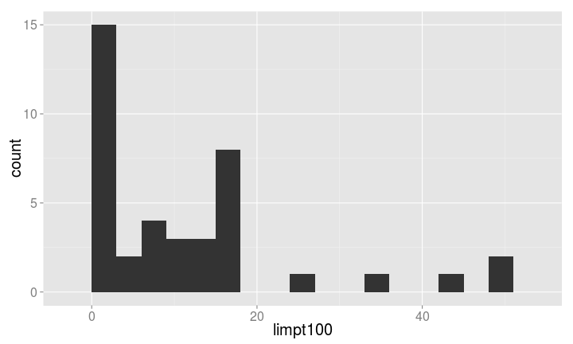

---

## Не нравится тема? Можно привинтить другую!

Можно прибавить к графику `theme_bw()`, `theme_classic()`, `theme_grey()`

Можно установить для всех последующих графиков `theme_set()`


```r
# ggplot(data = minch, aes(x = limpt100)) + geom_histogram(stat = "bin", binwidth = 3) + theme_classic()
theme_set(theme_bw())
ggplot(data = minch, aes(x = limpt100)) + 
  geom_histogram(stat = "bin", binwidth = 3)
```

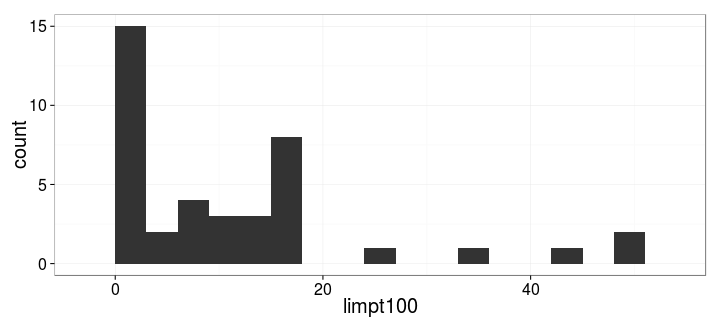

---

## Раскрашиваем гистограмму

эстетика `fill`


```r
hp <- ggplot(data = minch, aes(x = limpt100, fill = site)) + 
  geom_histogram(stat = "bin", binwidth = 3, position = "dodge") +
  labs(x = "Число улиток на 100 устриц", y = "Число проб", fill = "Сайт")
hp # теперь гистограмму из этого объекта можно вызвать в любой момент
```

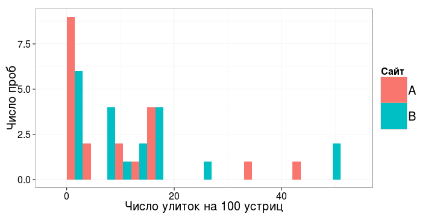

---

## Раскрасить иначе? Нет проблем!


```r
# Чтобы не переписывать всеменяем только эстетику
hp + aes(fill = zone) +  labs(fill = "Зона литорали")
```

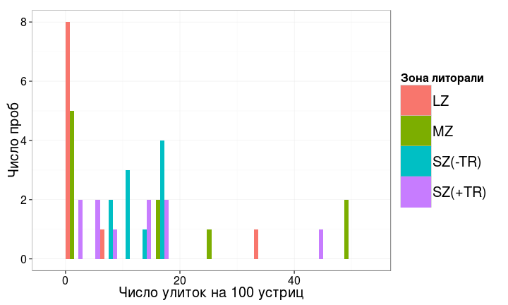

---

## График с панелями

Фасеты `facet_wrap`, `facet_grid`


```r
hp + facet_wrap(~ zone)
```

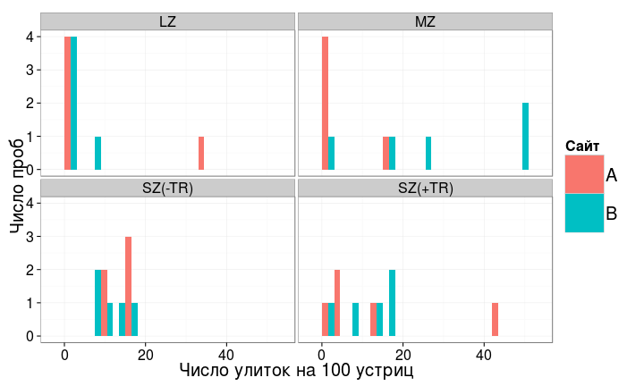

--- .prompt

## Поэкспериментируйте с панелями

Что происходит, если мы выбираем другие переменные? Почему?

Какие еще бывают варианты разбивки на панели?<br />
<small>Автоподсказки: напишите `facet` и нажмите `Ctrl+Space`</small>

Что будет если менять `fill` и `facet` одновременно?


```r
    ggplot()
    aes()
    geom_histogram()
    facet_wrap()
```

---

## Решение


```r
# hp + aes(fill = limpt100) # ошибка, т.к. непрерывная шкала, вместо дискретной
# у эстетики должна быть дискретная шкала

# одновременно панели и раскрашивание
hp + facet_grid(site~zone) + aes(fill = zone) 
```

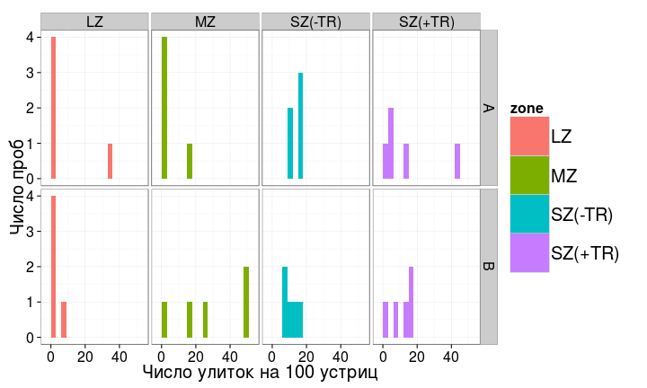

---

## Боксплоты числа улиток


```r
bp <- ggplot(data = minch, aes(x = site, y = limpt100)) + 
  geom_boxplot()
bp
```

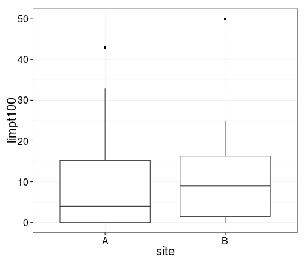

--- .prompt

## Дома самостоятельно поэкспериментируйте


с панелями `facet` и с эстетиками `fill` и `colour`

Что будет, если мы выберем другие переменные?

Опишите форму и разброс распределения улиток в двух сайтах  
Симметрично? Похоже ли на нормальное?


```r
    ggplot()
    aes()
    geom_boxplot()
    facet_wrap()
```

--- 

## Решение


```r
    bp + aes(colour = zone)
    bp + aes(fill = site)
    bp + aes(fill = site) + facet_wrap(~zone)
    bp + facet_grid(site~zone)
```

--- .prompt

## ...и постройте


боксплот и гистограмму переменной __sqlim100__ (квадратный корень из численности улиток) для двух сайтов<br />

<small>Подсказка: `x` и `y` это тоже эстетики, поэтому можно использовать предыдущие графики</small>

Стало ли распределение больше походить на нормальное?


```r
    ggplot()
    geom_histogram()
    geom_boxplot()
    aes()
```

---

## Решение


```r
bp + aes(fill = site)
bp + aes(y = sqlim100, fill = site)
hp + aes(fill = site) + labs(fill = "Сайт")
hp + aes(x = sqlim100, fill = site) + labs(fill = "Сайт")
```

--- .segue

# A priory анализ мощности по данным пилотного исследования

---  .sub-section

## Пилотное исследование халиотисов

2 сайта, 4 зоны, по 2 пробы
Мы хотим сравнить сайты


```r
minch_smpl <- readWorksheetFromFile("./data/minch_smpl.xls", sheet = 1)
ggplot(minch_smpl, aes(x = site, y = sqlim100)) + 
  geom_boxplot(aes(fill = site))
```

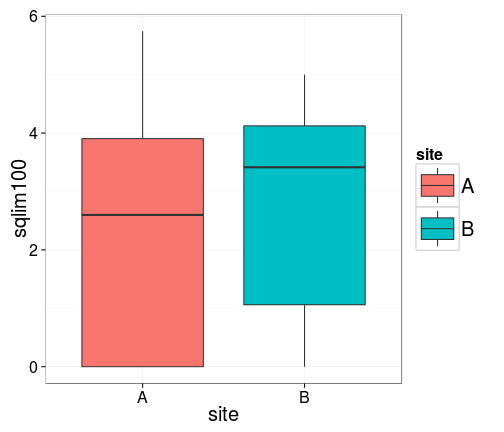

---

## Величина эффекта по исходным данным


```r
library(effsize)
effect <- cohen.d(minch_smpl$sqlim100, minch_smpl$site)
effect
```

```
## 
## Cohen's d
## 
## d estimate: -0.159 (negligible)
## 95 percent confidence interval:
##   inf   sup 
## -1.31  0.99
```

>- как добыть из нее значение величины эффекта?

---

## Обращении к переменным по имени - `$`

### Как называется в структуре объекта элемент, где записана величина эффекта?


```r
str(effect) # effect$estimate
```

```
## List of 7
##  $ method    : chr "Cohen's d"
##  $ name      : chr "d"
##  $ estimate  : Named num -0.159
##   ..- attr(*, "names")= chr "A"
##  $ conf.int  : Named num [1:2] -1.31 0.99
##   ..- attr(*, "names")= chr [1:2] "inf" "sup"
##  $ var       : Named num 0.535
##   ..- attr(*, "names")= chr "A"
##  $ conf.level: num 0.95
##  $ magnitude : chr "negligible"
##  - attr(*, "class")= chr "effsize"
```

```r
# Для pwr.t.test() эффект должен быть положительным, поэтому вычислим модуль
effect <- abs(effect$estimate) 
```

>- Очень слабый эффект...

--- .prompt

## Рассчитайте

объем выборки, чтобы показать различия плотности улиток между сайтами с вероятностью 0.8?


```r
    pwr.t.test()
```

---

## Решение


```r
library(pwr)
pwr.t.test(n = NULL, d = effect, power = 0.8, sig.level = 0.05, 
           type = "two.sample", alternative = "two.sided")
```

```
## 
##      Two-sample t test power calculation 
## 
##               n = 624
##               d = 0.159
##       sig.level = 0.05
##           power = 0.8
##     alternative = two.sided
## 
## NOTE: n is number in *each* group
```

>- Нужна выборка __624 площадки с каждого сайта__, чтобы с вероятностью 0.8 обнаружить различия плотности улиток между сайтами.

--- .segue

# Post hoc анализ мощности 

--- &twocol w1:30% w2:70%

## Пример: Улитки на устрицах в мангровых зарослях *

Что получилось бы на самом деле?

>- Достоверных различий плотности улиток между локациями не обнаружено (t-критерий, p<0.01)

<div class = "footnote">* - Данные из Quinn, Keough, 2002, Box 7-1, Fig 7-4</div>

*** {name: left}


```r
# bp <- ggplot(data = minch, aes(x = site, 
# y = limpt100)) + geom_boxplot()
bp + aes(y = sqlim100)
```

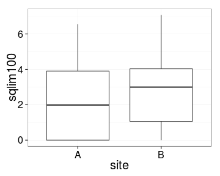

*** {name: right}


```r
# по умолчанию t-критерий для неравных дисперсий 
# (Модификация Велча)
t.test(sqlim100 ~ site, data = minch, 
       var.equal = FALSE)
```

```
## 
## 	Welch Two Sample t-test
## 
## data:  sqlim100 by site
## t = -1.15, df = 38, p-value = 0.2556
## alternative hypothesis: true difference in means is not equal to 0
## 95 percent confidence interval:
##  -2.198  0.602
## sample estimates:
## mean in group A mean in group B 
##            2.11            2.91
```

--- &twocol w1:40% w2:60%

## Post hoc анализ - когда различий не нашли

Какова была реальная величина эффекта?

Хватило ли нам мощности, чтобы выявлять такие незначительные различия?

*** =left

### Для post hoc анализа нужно знать

- тест ($H _0$ отвергнута!) — t-критерий
- уровень значимости — α = 0.05
- фактический объем выборки — 20
- фактическая величина эффекта — ?
- реальная мощность теста - ?

*** =right


```r
effect_real <- cohen.d(minch$sqlim100, minch$site)
effect_real <- abs(effect_real$estimate)
pwr.t.test(n = 20, d = effect_real, 
           power = NULL, sig.level = 0.05, 
           type = "two.sample", 
           alternative = "two.sided")
```

```
## 
##      Two-sample t test power calculation 
## 
##               n = 20
##               d = 0.365
##       sig.level = 0.05
##           power = 0.203
##     alternative = two.sided
## 
## NOTE: n is number in *each* group
```

--- .segue

# Как влиять на мощность теста?

---

## Мощность зависит 

- от объема выборки
- от величины эффекта
- от уровня значимости

---

## Чем больше объем выборки—тем больше мощность

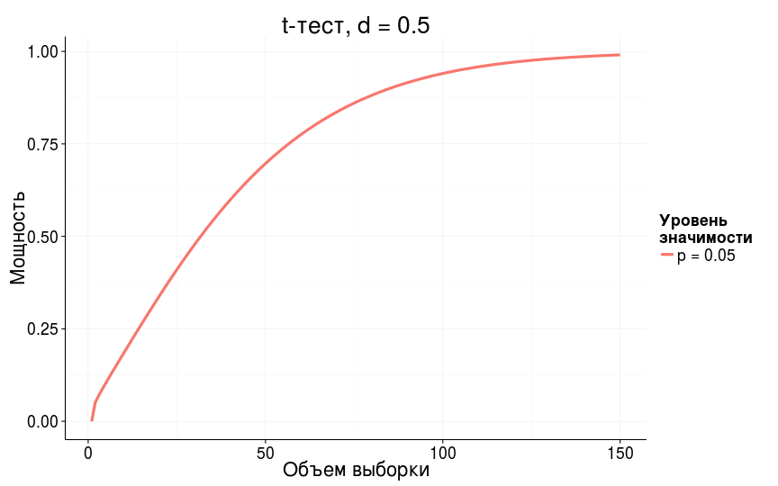

---

## Чем больше уровень значимости—тем больше мощность

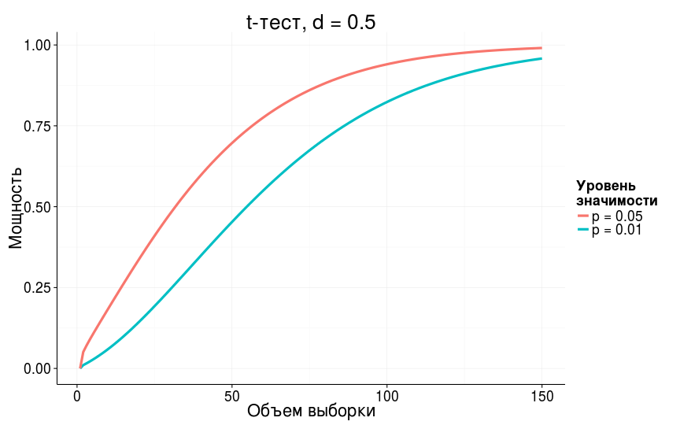

---

## Чем больше величина различий—тем больше мощность

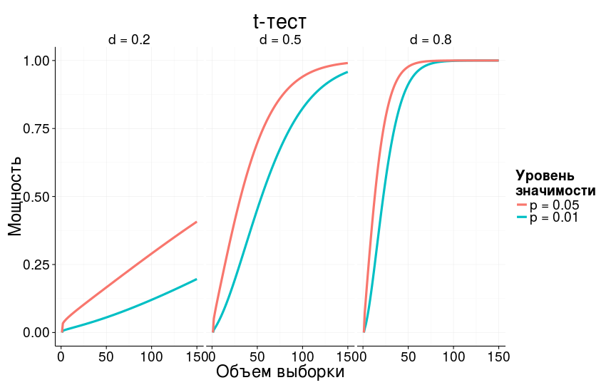

--- .prompt

## Скажите

Какие из факторов, влияющих на мощность теста, мы __не можем__ контролировать?

> - Мы не можем контролировать внешние факторы
    - величину эффекта ($ES$)
    - фоновую изменчивость ($\sigma^2$)

Каким образом можно повлиять на мощность теста?

> - Мощность теста можно регулировать, если
    - изменить число повторностей
    - выбрать другой уровень значимости ($\alpha$)
    - определиться, какие эффекты действительно важны ($ES$)

---

## Take home messages

>- Контролируем статистические ошибки:
  - чтобы не находить несуществующих эффектов, фиксируем уровень значимости
  - чтобы не пропустить значимое, рассчитываем величину эффекта, объем выборки и мощность теста
  - когда не обнаружили достоверных эффектов, оцениваем величину эффекта и мощность теста

>- Способность выявлять различия зависит 
  - от объема выборки, 
  - от уровня значимости
  - от величины эффекта

---

# Дополнительные ресурсы

- Quinn, Keough, 2002, pp. 164-170
- Open Intro to Statistics: [4.6 Sample Size and Power](http://www.openintro.org/stat/down/oiStat2_04.pdf), pp. 193-197  
- Sokal, Rohlf, 1995, pp. 167-169.  
- Zar, 1999, p. 83.
- [R Data Analysis Examples - Power Analysis for Two-group Independent sample t-test. UCLA: Statistical Consulting Group.](http://www.ats.ucla.edu/stat/r/dae/t_test_power2.htm)
- [R Data Analysis Examples - Power Analysis for One-sample t-test.  UCLA: Statistical Consulting Group.](http://www.ats.ucla.edu/stat/r/dae/t_test_power.htm) 
- [FAQ - How is effect size used in power analysis?  UCLA: Statistical Consulting Group.](http://www.ats.ucla.edu/stat/mult_pkg/faq/general/effect_size_power/effect_size_power.htm) 

